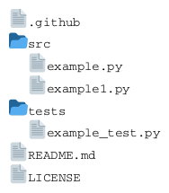
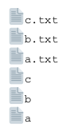
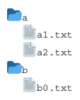
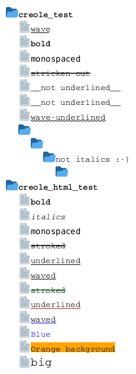
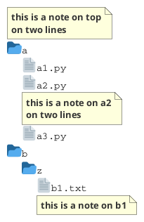

# Files tree diagram

- begin with @startfiles keyword
- end with @endfiles keyword.

```plantuml
@startfiles
/.github
/src/example.py
/tests/example_test.py
/src/example1.py
/README.md
/LICENSE
@endfiles
```

## Order

```plantuml
@startfiles
/c.txt
/b.txt
/a.txt
/c
/b
/a
@endfiles
```

## Merge

```plantuml
@startfiles
/a/a1.txt
/b/b0.txt
/a/a2.txt
@endfiles
```

## Creole on Files tree

```plantuml
@startfiles
/**creole_test**/~~wave~~
/**creole_test**/**bold**
/**creole_test**/""monospaced""
/**creole_test**/--stricken-out--
/**creole_test**/__not underlined__
/**creole_test**/~__not underlined__
/**creole_test**/~~wave-underlined~~
/**creole_test**///not italics :-)//

/**creole_html_test**/<b>bold
/**creole_html_test**/<i>italics
/**creole_html_test**/<font:monospaced>monospaced
/**creole_html_test**/<s>stroked
/**creole_html_test**/<u>underlined
/**creole_html_test**/<w>waved
/**creole_html_test**/<s:green>stroked
/**creole_html_test**/<u:red>underlined
/**creole_html_test**/<w:#0000FF>waved
/**creole_html_test**/<color:blue>Blue
/**creole_html_test**/<back:orange>Orange background
/**creole_html_test**/<size:20>big
@endfiles
```

## Using notes

```plantuml
@startfiles
<note>
this is a note on top
on two lines
</note>
/a/a1.py
/a/a2.py
<note>
this is a note on a2
on two lines
</note>
/a/a3.py
/b/z/b1.txt
<note>
this is a note on b1
</note>
@endfiles
```
