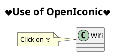
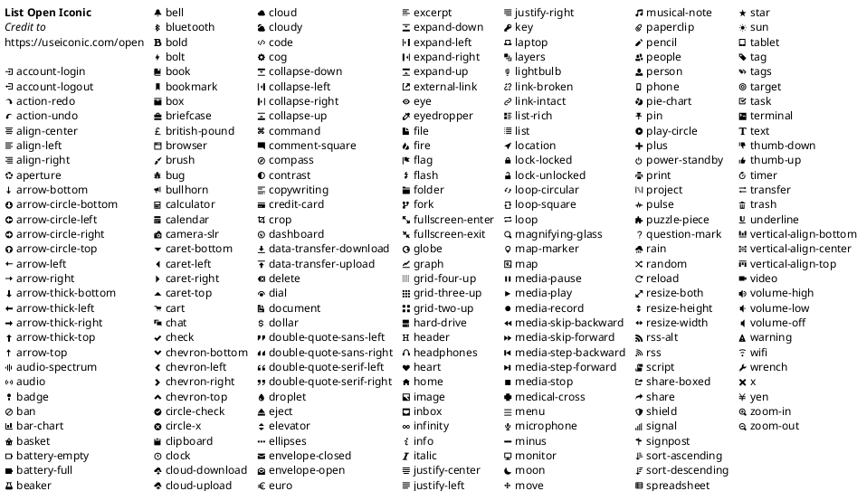

# OpenIconic

```plantuml
@startuml
title: <size:20><&heart>Use of OpenIconic<&heart></size>
class Wifi
note left
  Click on <&wifi>
end note
@enduml
```

```plantuml
@startsalt
{
  Login<&person> | "MyName   "
  Password<&key> | "****     "
  [Cancel <&circle-x>] | [OK <&account-login>]
}
@endsalt
```

```plantuml
@startuml
listopeniconic
@enduml
```
