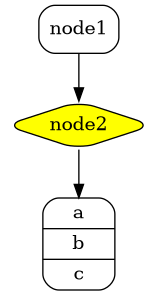
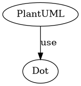

# Generalisation

PlantUML Advanced usage Dot diagram    Â

## DOT

```plantuml
@startdot
digraph foo {
  node [style=rounded]
  node1 [shape=box]
  node2 [fillcolor=yellow, style="rounded,filled", shape=diamond]
  node3 [shape=record, label="{ a | b | c }"]

  node1 -> node2 -> node3
}
@enddot
```

```plantuml
@startdot
digraph foo {
 PlantUML -> Dot [label=use];
}
@enddot
```
