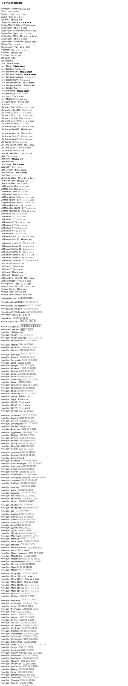
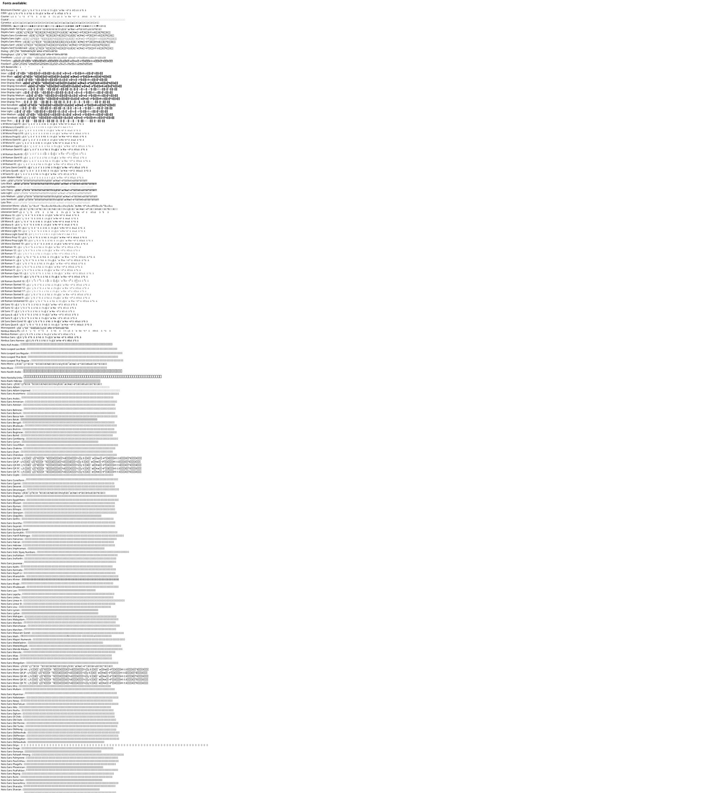
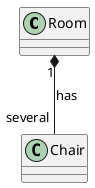

# Font

PlantUML News and information Font    Â

```plantuml
@startuml
listfonts
@enduml
```

```plantuml
@startuml
listfonts 私は申し訳ありません：私は日本語を話さない。
@enduml
```

## Examples

```plantuml
@startuml
skinparam defaultFontName Segoe UI
Room *-- Chair : "1" has "several"
@enduml
```

```plantuml
@startuml
skinparam defaultFontName VL Gothic
部屋 *-- 椅子 : "1" 持っています "いくつか"
@enduml
```
